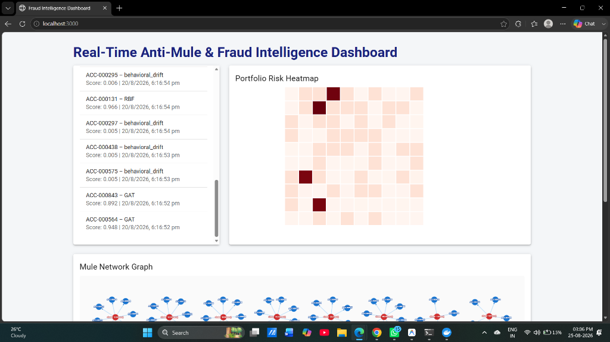
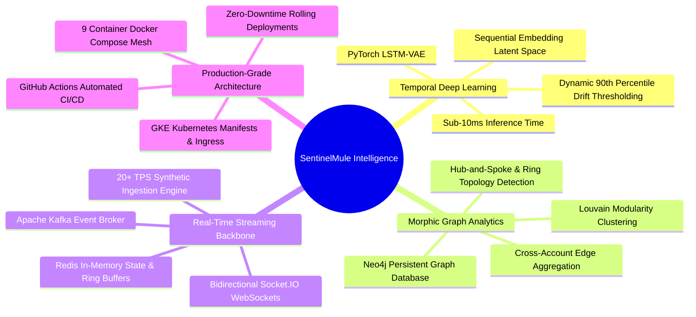
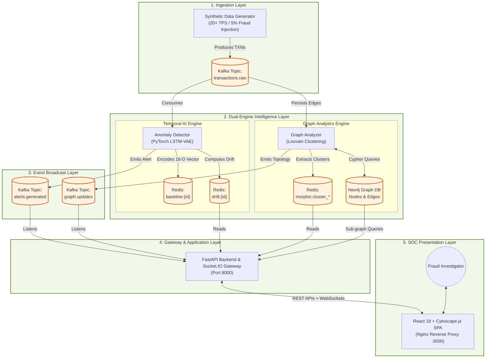

<div align="center">

# 🛡️ SentinelMule — Real-Time Anti-Mule & Fraud Intelligence Solution

### *High-Throughput Stream Processing, Temporal VAE Behavioral Drift Detection & Morphic Graph Community Intelligence*

[](docker-compose.yml)
[](services/api/)
[](services/detector/)
[](services/graph-analyzer/)
[](docker-compose.yml)
[](services/dashboard/)
[](k8s/)

<p align="center">
  <a href="#-key-capabilities">Key Capabilities</a> •
  <a href="#-system-architecture">Architecture</a> •
  <a href="#-interactive-dashboard--visual-intelligence">Visual Intelligence</a> •
  <a href="#-fraud-typologies-detected">Fraud Typologies</a> •
  <a href="#-quick-start">Quick Start</a> •
  <a href="#-api-documentation">API Reference</a> •
  <a href="#-cloud--kubernetes-deployment">Deployment</a>
</p>

---

</div>

## 📌 Executive Summary

**SentinelMule** is an enterprise-grade, sub-second anti-money laundering (AML) and mule account detection platform designed for real-time banking environments. By synthesizing **temporal behavioral deep learning (PyTorch LSTM-VAE)** with **dynamic graph community clustering (Neo4j + NetworkX Louvain)** over an event-driven **Kafka** backbone, SentinelMule uncovers hidden mule syndicates, money laundering layering, and smurfing rings *before* funds exit the banking perimeter.

```
Incoming Transactions (20+ TPS) 
  ↳ Apache Kafka Stream 
      ├── Temporal VAE (PyTorch): Sub-10ms Behavioral Drift Detection
      └── Graph Ingestion & Louvain (Neo4j): Multi-Hop Community Ring Detection
          ↳ Real-Time WebSocket Alerts ➔ Interactive Cytoscape & React SOC Dashboard
```

---

## 📸 Interactive Dashboard & Visual Intelligence

<div align="center">

### 🖥️ Security Operations Center (SOC) Live Dashboard
*Real-time alert streaming, anomaly scoring, and portfolio risk distribution.*



</div>

<details open>
<summary><b>🔍 Visual Components Breakdown (Click to collapse/expand)</b></summary>
<br>

| Visual Module | Technology | Functional Capability |
| :--- | :--- | :--- |
| **🚨 Live Alert Stream** | `Socket.IO` + `Redis` | Instant push notifications of flagged accounts with anomaly drift score, typology classification, and millisecond timestamps. |
| **🟥 Portfolio Risk Heatmap** | `React` + `CSS Grid` | 64-cell interactive matrix tracking live behavioral volatility. Clicking any cell opens deep account telemetry and recent transactions. |
| **🕸️ Mule Network Graph** | `Cytoscape.js` + `Neo4j` | Interactive force-directed topological graph rendering Louvain-detected mule rings, hub nodes, and illicit fund routing. |
| **🧬 Behavioral DNA Modal** | `FastAPI` + `NumPy` | 16-dimensional latent space vector comparison contrasting standard user baseline against active transaction burst. |

</details>

---

## ⚡ Key Capabilities



- ⏱️ **Sub-Second Latency**: Processes, scores, and visualizes transactions in under 50 milliseconds end-to-end.
- 🧠 **Zero-Day Typology Detection**: Unsupervised Temporal VAE detects novel mule behaviors without relying solely on rigid rule sets.
- 🌐 **Graph Sybil Defense**: Detects distributed smurfing rings where individual transactions fall under conventional regulatory reporting thresholds.
- 📊 **Unified Analyst Cockpit**: Single-pane dashboard combining temporal drift analytics, interactive network graphs, and automated audit trails.

---

## 🏗️ System Architecture



---

## 🎯 Fraud Typologies Detected

SentinelMule is pre-configured with mathematical heuristics and deep representations to capture the most complex money laundering patterns:

| Typology Code | Typology Name | Structural Signature | Detection Mechanism |
| :--- | :--- | :--- | :--- |
| **`GAT`** | **Gather-and-Transfer** | Many dispersed accounts funneling money into a single aggregator hub. | Graph in-degree anomaly + high volume temporal drift. |
| **`DMR`** | **Dormant Account Resurrection** | Account inactive for >180 days suddenly transacting large sums. | Extreme VAE latent reconstruction error against historical baseline. |
| **`RBF`** | **Rapid Burst Fan-out (Smurfing)** | Single high-value deposit split into dozens of sub-threshold transfers within minutes. | Graph out-degree velocity + burst rate deviation. |
| **`CAL`** | **Circular Asset Layering** | Fund routing through $A \rightarrow B \rightarrow C \rightarrow A$ loops to obscure origins. | Neo4j Cypher cycle detection & Louvain modularity clusters. |
| **`AEV`** | **Atmosphere Velocity Drift** | Transactions originating from impossible geographic or device hops. | Feature vector deviation across location, velocity, and time-of-day. |

---

## 📦 Microservices Matrix

The entire solution runs as **9 coordinated microservices**:

```
.
├── docker-compose.yml              # Complete 9-container local orchestration
├── start.bat                       # One-click Windows startup script
├── k8s/                            # Production Kubernetes manifests & Ingress
├── .github/workflows/              # Automated CI/CD (GCP Artifact Registry + GKE)
├── scripts/                        # Infrastructure automation scripts
└── services/
    ├── api/                        # FastAPI + Socket.IO async gateway (Port 8000)
    ├── dashboard/                  # React 18 + Cytoscape + Nginx SPA (Port 3000)
    ├── detector/                   # PyTorch LSTM Temporal VAE Worker
    ├── graph-analyzer/             # Neo4j & Louvain community clusterer
    └── generator/                  # Realistic transaction & fraud stream generator
```

| Container | Image / Base | Ports | Role |
| :--- | :--- | :--- | :--- |
| `dashboard` | `node:18-alpine` ➔ `nginx:alpine` | `3000:80` | Static React SPA with Nginx reverse proxy routing `/api` and `/socket.io`. |
| `api-server` | `python:3.9-slim` | `8000:8000` | REST API, OpenAPI docs, and asynchronous Socket.IO event broadcaster. |
| `anomaly-detector` | `python:3.9-slim` + PyTorch CPU | *Worker* | Real-time latent vector extraction and drift score computation. |
| `graph-analyzer` | `python:3.9-slim` + NetworkX | `8080` | Neo4j graph population and 15-second periodic Louvain clustering. |
| `data-generator` | `python:3.9-slim` + Faker | *Worker* | High-throughput streaming engine with parameterized fraud typologies. |
| `kafka` | `confluentinc/cp-kafka:7.5.0` | `9092, 29092` | Distributed streaming event broker with auto topic creation. |
| `zookeeper` | `confluentinc/cp-zookeeper:7.5.0`| `2181` | Coordination engine for Kafka cluster management. |
| `redis` | `redis:7-alpine` | `6379:6379` | In-memory key-value cache with `allkeys-lru` eviction policy. |
| `neo4j` | `neo4j:5-community` (APOC) | `7474, 7687` | Property graph database storing accounts, edges, and transaction metadata. |

---

## 🚀 Quick Start

### Prerequisites
- [Docker Desktop](https://www.docker.com/products/docker-desktop/) (with WSL2 backend enabled on Windows)
- Git

### 1. Clone & Start
```bash
# Clone the repository
git clone https://github.com/vaishnaviwangalwar-cpu/anti-mule-solution.git
cd anti-mule-solution

# Start all 9 services with a single command
docker compose up --build -d
```
*(On Windows, you can also simply double-click `start.bat`)*

### 2. Access the Applications

| Interface | URL | Credentials |
| :--- | :--- | :--- |
| **Interactive SOC Dashboard** | [http://localhost:3000](http://localhost:3000) | *None (Public)* |
| **Interactive Swagger API Docs** | [http://localhost:8000/docs](http://localhost:8000/docs) | *None (Public)* |
| **Neo4j Graph Browser** | [http://localhost:7474](http://localhost:7474) | `neo4j` / `password` |

---

## 🌐 Instant Public Demo (No Cloud Billing Required)

To share the live dashboard with judges or remote team members without deploying to cloud providers:

```powershell
# Run in your PowerShell / Terminal to open a secure HTTPS tunnel
ssh -o StrictHostKeyChecking=no -o ServerAliveInterval=60 -R 80:localhost:3000 nokey@localhost.run
```

*This generates a secure `https://<subdomain>.lhr.life` address that can be accessed from any phone, laptop, or tablet in real-time.*

---

## 🔌 API Documentation & Interactive Endpoints

The API is fully documented using OpenAPI standard at `/docs`. Below are key endpoints:

### Core Endpoints

#### 1. Retrieve Live Alerts
```http
GET /api/v1/alerts?page=1&size=20
```
<details>
<summary><b>Sample Response (JSON)</b></summary>

```json
{
  "alerts": [
    {
      "account_id": "ACC-000131",
      "drift_score": 0.966,
      "threshold": 0.850,
      "timestamp": "2026-08-25T18:30:00Z",
      "type": "RBF"
    },
    {
      "account_id": "ACC-000564",
      "drift_score": 0.948,
      "threshold": 0.850,
      "timestamp": "2026-08-25T18:29:55Z",
      "type": "GAT"
    }
  ],
  "page": 1,
  "size": 20,
  "total": 52
}
```
</details>

#### 2. Get Portfolio Risk Heatmap Matrix
```http
GET /api/v1/heatmap
```

#### 3. List Louvain Graph Clusters
```http
GET /api/v1/graph/clusters
```

#### 4. Account Behavioral DNA (16-D Latent Vector)
```http
GET /api/v1/accounts/ACC-000102/behavioral-dna
```

#### 5. Health & Kubernetes Readiness Probes
```http
GET /healthz  # Liveness probe (Returns status: ok)
GET /readyz   # Readiness probe (Validates Redis & Neo4j connectivity)
```

---

## ☁️ Cloud & Kubernetes Deployment (GCP / GKE)

SentinelMule includes enterprise-ready **Kubernetes manifests** and automated **GitHub Actions CI/CD pipelines**:

```
k8s/
├── namespace.yaml                  # 'antimule' isolated namespace
├── secrets.yaml                    # Base64 encrypted secrets
├── ingress.yaml                    # GKE Cloud Load Balancer & Ingress routing
├── kafka/ (kafka.yaml, zookeeper.yaml)
├── redis/ (redis.yaml)
├── neo4j/ (neo4j.yaml)
└── api-server/, dashboard/, anomaly-detector/, graph-analyzer/, data-generator/
```

### Automated GCP Setup
Run the included provisioning script in Git Bash / Linux:
```bash
./scripts/gcp-setup.sh <YOUR_GCP_PROJECT_ID> us-central1 <YOUR_GITHUB_REPO>
```
*Creates GKE Autopilot cluster, Artifact Registry, IAM service accounts, and Workload Identity Federation OIDC.*

For the complete cloud deployment manual, refer to [**`DEPLOY.md`**](DEPLOY.md).

---

## 🧪 Mathematical Deep Dive: Temporal VAE

The Temporal VAE models normal transaction dynamics as a sequence of transaction vectors $X = \{x_1, x_2, \dots, x_T\}$ passing through an LSTM Encoder $q_\phi(z|X)$:

$$\mathcal{L}(\theta, \phi; X) = \mathbb{E}_{q_\phi(z|X)} [\log p_\theta(X|z)] - D_{KL}(q_\phi(z|X) \parallel p(z))$$

Where:
- $\mathbb{E}_{q_\phi(z|X)} [\log p_\theta(X|z)]$ is the reconstruction fidelity of recent user transactions.
- $D_{KL}$ is the Kullback-Leibler divergence constraining the latent representation to prior $\mathcal{N}(0, I)$.
- **Drift Metric**: Calculated as normalized cosine distance between the dynamic baseline vector $\mu_{\text{baseline}}$ and the current latent embedding $\mu_{\text{active}}$:

$$\text{Drift}(t) = 1 - \frac{\mu_{\text{baseline}} \cdot \mu_{\text{active}}}{\|\mu_{\text{baseline}}\| \|\mu_{\text{active}}\|}$$

When $\text{Drift}(t) > \tau_{90}$, an immediate alert is generated and dispatched to the Kafka event bus.

---

## 👥 Contributors & Hackathon Team

Developed with ❤️ for the **BOIXIITH Hackathon**.

- **Vaishnavi Wangalwar** — *Lead Developer & System Architect*

---

<div align="center">

⭐ **If you found this solution insightful, please star the repository!** ⭐

</div>
